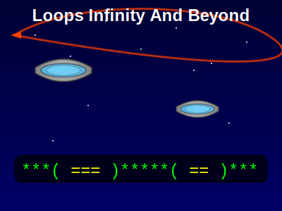

# Loops Infinity And Beyond



## Description

Loops Infinity And Beyond is a Java utility class that demonstrates advanced string manipulation and pattern recognition techniques. This project showcases the power of loops and string operations to solve complex problems involving "flying saucer" patterns within strings.

## Features

- Detect and measure the length of "flying saucer" patterns in strings
- Count the number of valid "flying saucer" patterns in a given string
- Fix broken "flying saucer" patterns by removing intervening characters
- Simulate the movement of "flying saucers" within a string

## Key Concepts

- String manipulation
- Pattern recognition
- Loop-based algorithms
- Wrapping string operations

## Usage

To use the LoopsInfinityAndBeyond class in your project:

1. Import the class:
   ```java
   import mini.LoopsInfinityAndBeyond;
   ```

2. Call the static methods:
   ```java
   int length = LoopsInfinityAndBeyond.flyingSaucerLength("(===)");
   int count = LoopsInfinityAndBeyond.countFlyingSaucers("(==)**(=)");
   String fixed = LoopsInfinityAndBeyond.fixFlyingSaucer("(==***==)");
   String moved = LoopsInfinityAndBeyond.flyingSaucersFly("**(==)*");
   ```

## Example

```java
public class LoopsInfinityAndBeyondDemo {
    public static void main(String[] args) {
        String input = "***(===)***";
        
        int length = LoopsInfinityAndBeyond.flyingSaucerLength(input);
        System.out.println("Flying saucer length: " + length);
        
        int count = LoopsInfinityAndBeyond.countFlyingSaucers(input);
        System.out.println("Number of flying saucers: " + count);
        
        String fixed = LoopsInfinityAndBeyond.fixFlyingSaucer("***(==****===)***");
        System.out.println("Fixed flying saucer: " + fixed);
        
        String moved = LoopsInfinityAndBeyond.flyingSaucersFly(input);
        System.out.println("Moved flying saucer: " + moved);
    }
}
```

## API Highlights

- `flyingSaucerLength(String s)`: Find the length of the first flying saucer in a string
- `countFlyingSaucers(String s)`: Count the number of valid flying saucers in a string
- `fixFlyingSaucer(String s)`: Fix a broken flying saucer by removing intervening characters
- `flyingSaucersFly(String s)`: Move all flying saucers one character to the right

## Future Improvements

- Implement more complex pattern recognition algorithms
- Add support for different types of "spacecraft" patterns
- Create a graphical representation of the flying saucers
- Optimize algorithms for better performance with large strings
- Add unit tests to ensure reliability of all methods

## Author

Abhay Prasanna Rao
